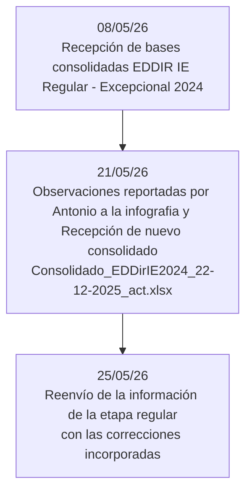

# MINEDU-2026-05-INF_NACIONAL_EDDIR_IE_REG_EXCEP_2024_2025

### Historial

* 25/05/26 se reenvia la información de la etapa regular con la nueva información.
* 21/05/26 como resultado de un correo por parte de Antonio donde señala algunas cifras que deben ser ajustadas, nos comparten un nuevo consolidado llamado "Consolidado_EDDirIE2024_22-12-2025_act.xlsx"
* 08/05/26 se adjuntaron las bases consolidadas del concurso EDDIR IE Regular - Excepcional 2024, alojadas en “\10.1.1.92\died\ANALISIS Y DIFUSION\1. DIFUSIÓN\Cristian\2026\Solicitudes de información\Eddir IE 2024_2025 - Informe Nacional\Outputs”.

### Descriptivos

* Cruce de la variable **SeRealizoEvaluacion_actualizado** y **ESTADODEEVALUACIÓN_actualizado**, muestra que efectivamente todos los docentes con estado APROBADO, DESAPROBADO y PENDIENTE son considerados dentro del concepto de "Evaluados". 

| SeRealizoEvaluacion_actualizado | APROBADO | DESAPROBADO | NO EVALUADO | PENDIENTE |  All |
| :------------------------------ | -------: | ----------: | ----------: | --------: | ---: |
| No                              |        0 |           0 |         170 |         0 |  170 |
| Sí                             |     3183 |         201 |           0 |      2231 | 5615 |
| All                             |     3183 |         201 |         170 |      2231 | 5785 |

* En función de la anterior, cruzando la variable **SeRealizoEvaluacion_actualizado** y **MotivoNoEvaluacion_actualizado,** se puede visualizar los motivos de no evaluación:

| MotivoNoEvaluacion_actualizado                           |  No |  Sí |  All |
| :------------------------------------------------------- | --: | ---: | ---: |
| -                                                        |   0 | 5615 | 5615 |
| Renuncia formal al cargo en el que ha sido designado     |  64 |    0 |   64 |
| Retiro de la CPM por destitución con resolución firme  |   2 |    0 |    2 |
| Retiro de la CPM por fallecimiento                       |   7 |    0 |    7 |
| Retiro de la CPM por límite de edad                     |  34 |    0 |   34 |
| Retiro de la CPM por renuncia formal al cargo de docente |  63 |    0 |   63 |
| All                                                      | 170 | 5615 | 5785 |

* En función de la anterior, cruzando la variable **SeRealizoEvaluacion_actualizado** y **DIF_Mod_Perfil_evaluado**, se puede visualizar la distribución de los evaluados (APROBADOS, DESAPROBADOS y PENDIENTES): 

| DIF_Mod_Perfil_evaluado               |  No |  Sí |  All |
| :------------------------------------ | --: | ---: | ---: |
| EBA - Director - Con función docente |   0 |   15 |   15 |
| EBA - Director - Sin función docente |   1 |   35 |   36 |
| EBA - Subdirector - Ninguno           |   6 |  127 |  133 |
| EBE - Director - Con función docente |   1 |    4 |    5 |
| EBE - Director - Sin función docente |   0 |   42 |   42 |
| EBE - Subdirector - Ninguno           |   0 |    1 |    1 |
| EBR - Director - Con función docente |  54 | 1762 | 1816 |
| EBR - Director - Sin función docente |  78 | 2638 | 2716 |
| EBR - Subdirector - Ninguno           |  30 |  991 | 1021 |
| All                                   | 170 | 5615 | 5785 |

Respecto a las variables de resultado por subdimensiones.

* Solo filtrando por la siguiente tipologia **"Director Con función docente"** para la variable **D1S2**, y teniendo en cuenta la normativa, se hizo la imputación de vacios donde antes figuraba 0 en la nueva variable **DIF_D1S2**

|   | index | D1S2 | DIF_D1S2 |
| -: | ----: | ---: | -------: |
| 0 |     0 | 1781 |      nan |
| 1 |   nan |   55 |     1836 |

* Solo filtrando por la siguiente tipologia **"Subdirector Ninguno"** para la variable **D3S10**, y teniendo en cuenta la normativa, se hizo la imputación de vacios donde antes figuraba 0 en la nueva variable **DIF_D3S10**

|   | index | D3S10 | DIF_D3S10 |
| -: | ----: | ----: | --------: |
| 0 |     0 |  1119 |       nan |
| 1 |   nan |    36 |      1155 |

* Solo filtrando por la siguiente tipologia **"Subdirector Ninguno"** para la variable **D3S11**, y teniendo en cuenta la normativa, se hizo la imputación de vacios donde antes figuraba 0 en la nueva variable **DIF_D3S11**

|   | index | D3S11 | DIF_D3S11 |
| -: | ----: | ----: | --------: |
| 0 |     0 |  1119 |       nan |
| 1 |   nan |    36 |      1155 |
